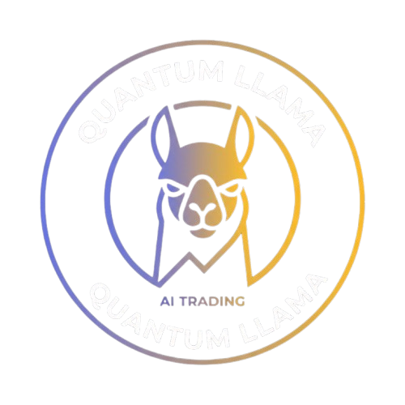
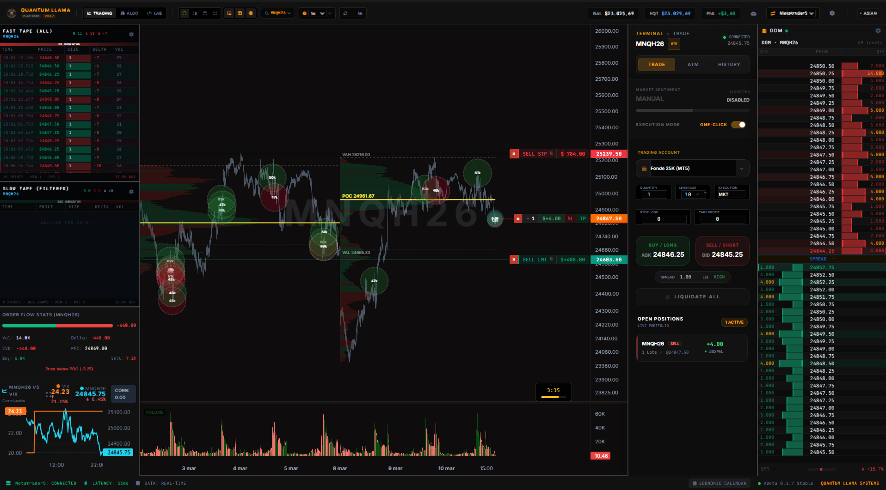
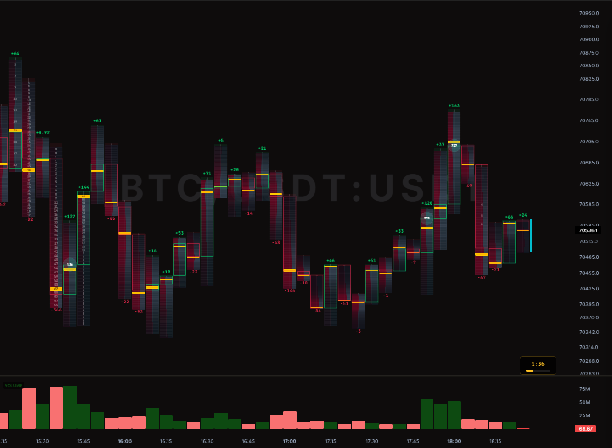
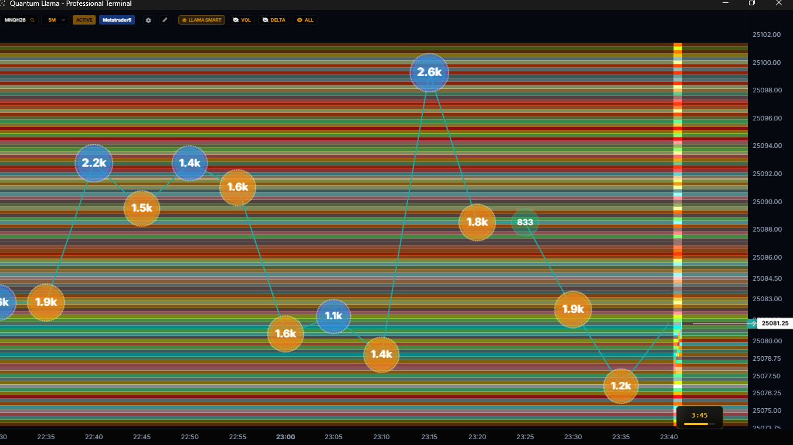

<h1 align="center">
  
  <br>
  Quantum Llama Terminal
</h1>

<p align="center">
  <strong>Advanced AI-Powered Trading Platform - Desktop Edition</strong>
</p>

<p align="center">
  
  
  
  
  
</p> 

---

## 📖 Table of Contents
- [🚀 Overview](#-overview)
- [✨ Key Features](#-key-features)
- [📦 Native Desktop Distribution](#-native-desktop-distribution)
- [🛠️ Technology Stack](#-technology-stack)
- [🏗️ Developer Installation](#-developer-installation)
- [🛡️ License](#-license)

---

## 🚀 Overview

**Quantum Llama Terminal** is a professional, institutional-grade desktop trading platform designed for modern algorithmic and manual trading. Powered by an **Electron** frontend and a high-performance **Python (FastAPI)** backend, it integrates bleeding-edge Machine Learning and Deep Learning models to provide unparalleled market insights.

Whether you are trading Traditional Finance (TradFi) or Cryptocurrencies (DeFi), Quantum Llama offers seamless execution, advanced order flow visualization, and AI-driven predictive analytics.

---

## ✨ Key Features

### 📊 Advanced Order Flow & Charting
- **Footprint Charts**: Granular view of bid/ask volume imbalance at every price level.
- **Bookmap / DOM (Depth of Market)**: High-definition liquidity visualization and order book heatmaps.
- **Microstructure Analysis**: Tick-level data processing for precision entries and exits.

### 🤖 AI & Machine Learning Integration
- **Deep Learning Models**: Powered by `PyTorch` and `Transformers` for sequence modeling and predictive analytics.
- **Machine Learning Algorithms**: Utilizing `XGBoost`, `Scikit-Learn`, and `Statsmodels` for robust signal generation.
- **Automated Algorithmic Execution**: Built-in algorithm runner and backtesting engine using `VectorBT`.

### 🔗 Multi-Broker & Multi-Exchange Support
- **MetaTrader 5 (MT5)**: Native integration for Forex, Indices, and Commodities.
- **Crypto Exchanges**: Supported via the robust `CCXT` library (Binance, Bybit, etc.).
- **Futures Platforms**: Integration keys for `NinjaTrader` and `Tradovate`.

### 💼 Institutional Mode Support
The platform includes 3 distinct, high-performance launch modes:
- **Terminal App**: The full UI with high-frequency order flow and ML charting.
- **Browser Mode**: A streamlined, lightweight web-native trading interface.
- **Trainer CLI**: A high-speed command-line interface for backtesting and strategy training.

---

## 📦 Native Desktop Distribution

Quantum Llama Terminal is distributed as a high-security binary, protecting core intellectual property while ensuring maximum performance.

### 🪟 Windows (NSIS Installer)
1. Download the `Quantum-Llama-Terminal-Setup.exe`.
2. Run the installer and follow the wizard instructions.
3. Access all modes via the desktop shortcuts.

### 🐧 Linux (Cross-Distro Support)

#### **Arch Linux / EndeavourOS / Manjaro**
Install the native `.pacman` package for the best system integration:
```bash
sudo pacman -U Quantum-llama-Terminal-1.8.1.pacman
```

#### **Ubuntu / Debian / Kali**
Use the standard `.deb` installer:
```bash
sudo dpkg -i Quantum-llama-Terminal_1.8.1_amd64.deb
sudo apt-get install -f  # To resolve dependencies
```

#### **Portable (AppImage)**
Runs on any modern Linux distribution without installation:
```bash
chmod +x "Quantum Llama Terminal-1.8.1.AppImage"
./"Quantum Llama Terminal-1.8.1.AppImage"
```

---

---

## 📸 Platform Screenshots

### Main Trading Terminal


### Footprint Charting


### Bookmap / Order Book Heatmap


---

## 🛠️ Technology Stack

| Component | Technologies Used |
|-----------|-------------------|
| **Frontend** | Electron, JavaScript/HTML/CSS, Monaco Editor |
| **Backend** | Python, FastAPI, Uvicorn, WebSockets |
| **AI / Data Science** | PyTorch, Transformers, XGBoost, Pandas, Numpy |
| **Trading Interfaces** | MetaTrader5, CCXT, yFinance |
| **Backtesting** | VectorBT, TA-Lib |
| **Security & Build** | Bytenode, **Cython (Binary Compilation)**, Electron-Builder |

---

## 🏗️ Developer Installation

### Prerequisites
- **Node.js** (v18+)
- **Python** (3.10+)
- **Visual Studio Build Tools** (for compiling Python dependencies like TA-Lib)

### 1. Clone the Repository
```bash
git clone https://github.com/QuantLlama/Plataforma_LamaTerminal_V1.8.1b.git
cd Plataforma_LamaTerminal_V1.8.1b
```

### 2. Environment Setup
We provide automation scripts for a quick setup:

**Windows:**
```powershell
./setup_env.bat
```

**Linux / macOS:**
```bash
chmod +x setup_env.sh
./setup_env.sh
```

### 3. Frontend Setup
```bash
npm install
```

### 4. Run Development Servers
**Start Backend:**
```bash
# Windows
venv\Scripts\python.exe run.py
# Linux / macOS
source venv_linux/bin/activate
python run.py
```

**Start Desktop App:**
```bash
npm start
```

### 5. Build for Production
```bash
npm run dist
```

---

## 🛡️ License

This project is licensed under the [MIT License](LICENSE).

---

<p align="center">
  <em>Built with ❤️ by the Quantum Llama Team.</em>
</p>
